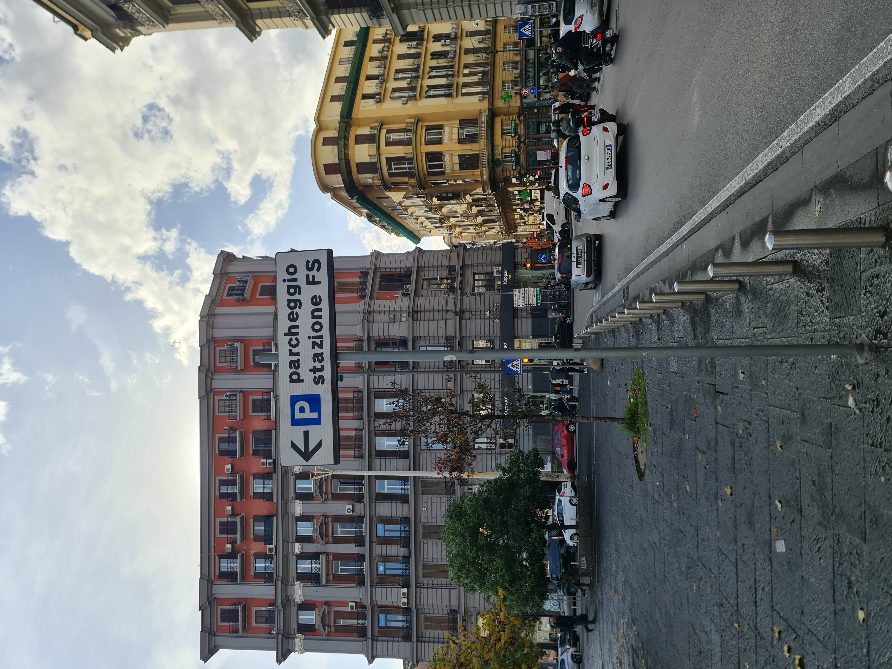
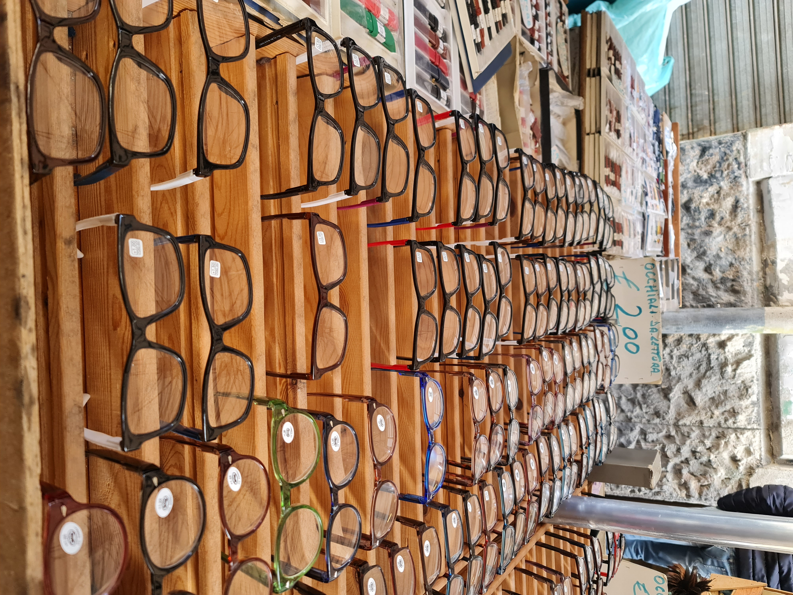
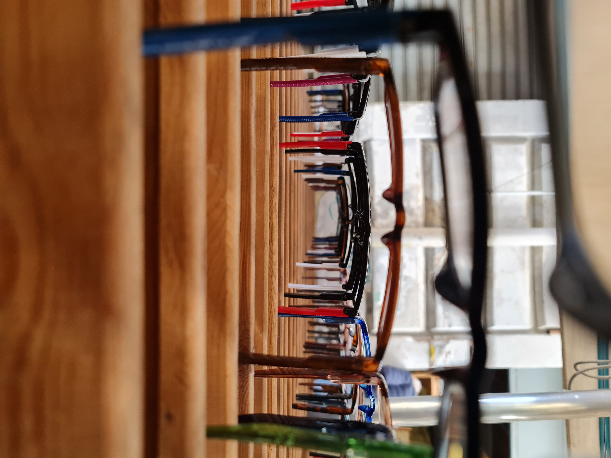

# Sguardo agli aspetti fondamentali

Nella giornata di Venerdì 13 Dicembre tutto il secondo anno ha discusso in merito alle tematiche e aspetti che abbiamo individuato e che creano in noi l'urgenza di una risposta artistica sul territorio di Piazza di Garibaldi.

## Stratificazione

Il primo aspetto è la stratificazione della piazza. Stratificazione sia a livello territoriale, ad esempio metropolitana > Piazza > Palazzi, sia a livello culturale, con le influenze linguistiche, commerciali, gastronomiche ecc. che si fondono con la cultura Napoletana del posto. Rientra nella stratificazione anche la Street Art.

## Multiculturalismo

Il Multiculturalismo può sembrare una ripetizione della stratificazione ma non è così. Per Multiculturalismo intendiamo non solo  le diverse culture etniche, ma anche di quelle che già esistono sul territorio di Garibaldi indipendentemente dalla provenienza geografiche della popolazione. Un esempio può essere l'opera architettonica sul passaggio della Linea 1, completamente in metallo che in estate crea disagi per l'enorme calore che trattiene: non stiamo parlando di persone nello specifico, ma di sicuro l'architetto che ha progettato questa struttura ha importato anche se in modo indiretto una tipologia di Cultura nella Piazza. Seguendo questo ragionamento non è difficile notare altri esempi: Graffiti, Presenza dell'Esercito, Mancanza di Verde ecc.

## Prospettive

Le prospettive racchiudono vari modi vedere, sentire e in generale interpretare la piazza. Ogni zona ha un suo specifico suono, con punti di vista che sono molto mutevoli, basti pensare alla differenza che c'è fra l'arena (Linea 2) e la zona del mercato, distanti non più di 500m. Inoltre ho realizzato insieme al mio gruppo degli scatti per far comprendere il concetto di "Prospettiva" in uno dei mercati.

Il concetto è che se visto di lato un cartello stradale, oltre a essere invisibile, non comunica nulla, invece con la giusta prospettiva comprendiamo il senso e l'interezza dell'oggetto.

Segue una prova già più accattivante da un punto di vista visivo.