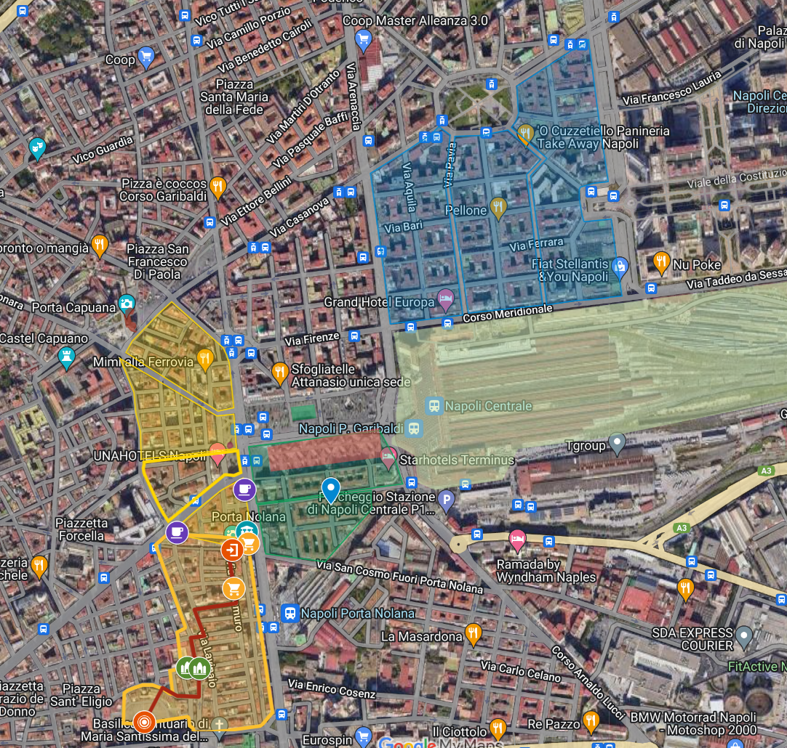

# La Mappa

Nella giornata di Lunedì 16 Dicembre abbaimo discusso su quelli che identifichiamo come i bordi della mappa di Garibaldi che ci siamo prefissati. È chiaro che non possono esistere dei confini, una linea che divide la nostra aera di studio da un'altra che non calcoliamo di striscio. A procida era semplice, c'era il mare a fare da confine, ma aGaribaldi quel confine non esiste, e quindi dobbiamo essere noi bravi a capillare i nostri studi senza escludere niente che possa servirci anche al di fuori delle nostre mappe.

Quindi cosa accade in quei punti? Un'aspetto che possiamo notare è che queste aree sono molto diverse fra loro. Le nostra mappe ad esempio tagliano da una parte il Vasto, zona abbastanza calma senza significativi luoghi di scambio fra atmosfere diverse; mentre i tagli presenti nella zona di San Lorenzo sono già più difficili da identificare. Sono punti che vivono a stretto contatto fra loro.

# Abitudini

Sempre in quella discussione abbiamo affrontato anche temi riguardanti le differenziazioni fra la nostra cultura occidentale e quella orenitale presente in Piazza. Per citarne una: anche in contesti formali o cerimonie c'è sempre l'usanza di mangiare a terra con le mani (cosa impensabile per noi) o ancora, per la cultura Pakistana il concetto del tempo è relativo: quando ci si dà appuntamento per un orario X non è maleducazione presentarsi ad ora Y.