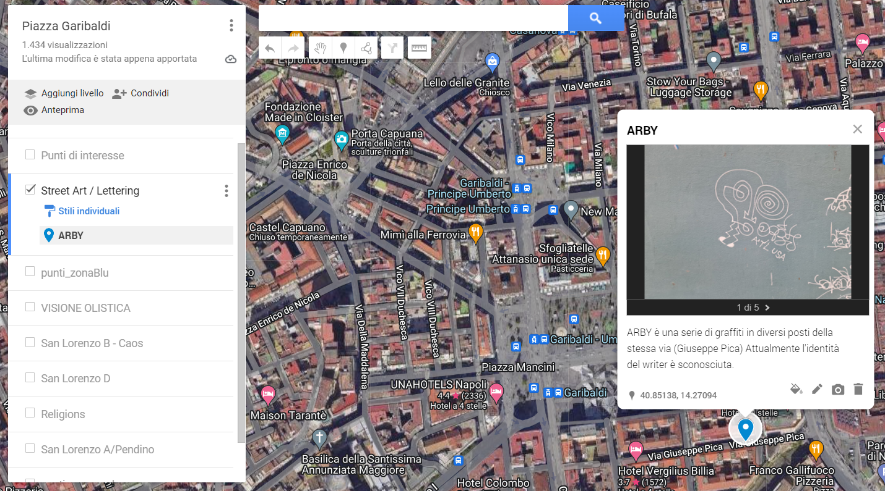

---
tags:
    - Garibaldi
---

# Foto su Maps

Nella giornata di Martedì 21 Gennaio 2025 è stato creato il livello sulla mappa di Mistake (linktree). Su di essa è possibile aggiungere punti con Titoli, Immagini e Descrizioni, molto utile per tenere traccia di Graffiti, Sticker e lettering in generale.

Inoltre ho provato a registrare un time lapse. Figo ma abbastanza confusionale.

<video width="640" height="360" controls>
  <source src="../videotimelapse.mp4" type="video/mp4">
</video>