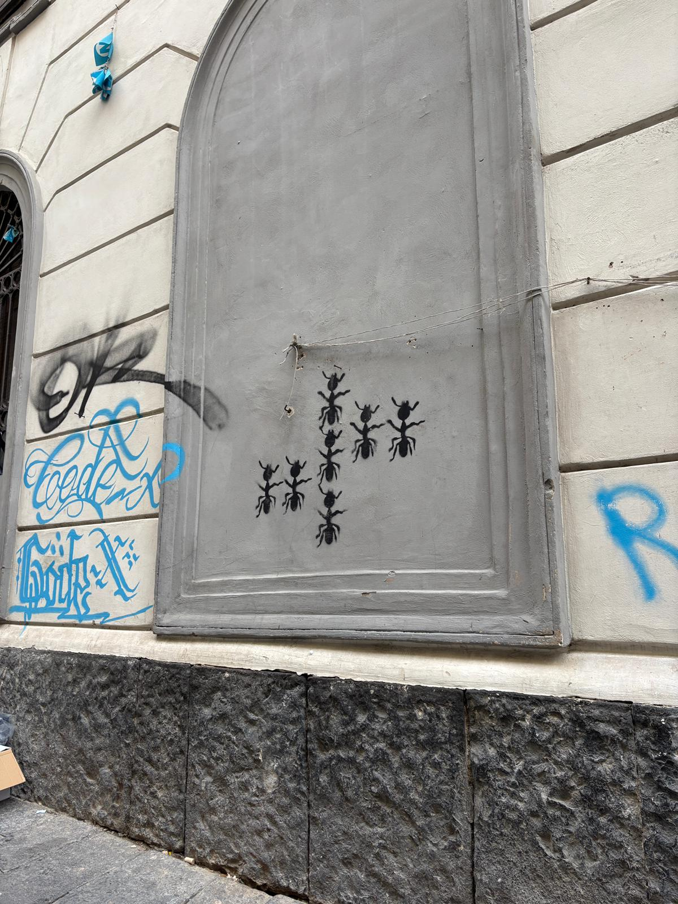

---
tags:
    - Garibaldi
---

# Street Art

Nella giornata del 5 Dicembre un gruppo di lavoro è andato a Garibaldi per un giro di perlustrazione per individuare la street art e in generale i graffiti più iconici della zona della piazza.

Il nostro intento era quello di esplorare questi atti soliti di vandalismo, in quanto hanno un messaggio, anche se sbagliato in certi casi, da raccontare. Molto diverso dalla carta a terra, che di per se non vuole raccontare un qualcosa di preciso.

Abbiamo notato che alcune attività commerciali usano i graffiti per promuoversi o per fare comunicazioni varie (esempio classico: divieto di sosta abusivo). Ma non solo, a Via Umberto sugli spartitraffico sono presenti scritte di bombolette spray che esplorano il tema di cambiamento, in quanto viene solitamente attraversata dai cortei.

Infine è lampante come attività commerciali di scommesse sportive e casinò sono trattate dalla popolazione locale meglio di altre come farmacie e in generale negozi di beni di prima necessità.

Allego qualche foto:

